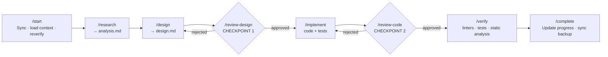
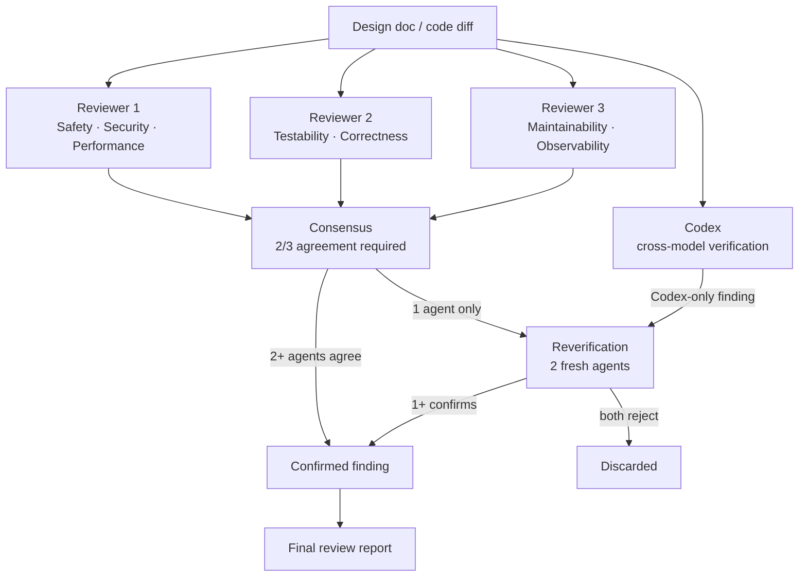

# GenAI Automations

Config backup repo for Claude Code and Codex AI platform configurations.

Claude is the primary workflow orchestrator — research, investigation, design, planning, and checkpoint coordination. Codex is the implementation and review partner, focused on repository edits, implementation follow-through, and independent review when delegated through `codex-flow`.

---

## Workflow

All implementation tasks follow a structured 8-phase cycle. Each phase is entered only when the user explicitly invokes its command — no automatic phase advancement.



**1. Think before doing** — research and design are mandatory phases that produce written artifacts before any code is written. Two review checkpoints then gate the transitions into implementation and into verification, so bad designs and bad code cannot quietly propagate forward.

**2. Human in the loop** — the AI cannot self-advance between phases. Every transition requires an explicit user invocation, keeping the human in the decision loop at every meaningful boundary rather than letting the model talk itself into proceeding.

**3. Persistent context** — planning artifacts (analysis, design docs, review reports) live in `planning/` alongside the code and are synced to a backup. Context survives session resets and machine switches without manual reconstruction.

**4. Composable utilities** — a set of utility commands handles targeted jobs (review loops, ticketing, Codex delegation, debugging, writing) without replacing the main cycle. Each is scoped to a single responsibility and composes cleanly with the phases above.

### Fighting Hallucinations

LLM reviews are unreliable when a single model judges its own output. This workflow uses three layered mechanisms to catch hallucinated findings and missed issues:

**1. Mandatory phase gates** — Design must be reviewed and approved before implementation begins; code must be reviewed and approved before verification. The AI cannot self-advance between phases; the user must explicitly invoke each step. This prevents an LLM from convincing itself its own output is correct.

**2. Multi-agent consensus** — Every review spawns three independent Claude (Opus) reviewer agents with differentiated focus areas (safety/security/performance; testability/correctness; observability/maintainability). A finding is included only if at least 2 of 3 agents flag it independently. Single-agent findings go through a separate 2-agent reverification pass before inclusion.

**3. Cross-model verification** — Codex runs in parallel with the Claude reviewers using a different model architecture. Codex-only findings are reverified by two additional Claude agents before inclusion. Findings confirmed by both Claude consensus and Codex are marked as corroborated.



---

## Planning Structure

Planning documents live in `planning/` and follow a per-issue layout:

```
planning/
├── progress.md                      # Active work: current issue, recently merged, next steps
├── reviews/                         # Ephemeral operational files (MR YAMLs, review-request docs)
└── <goal>/
    └── milestone-XX-<name>/
        ├── status.md
        └── issues/
            └── <NNN-name>/
                ├── analysis.md      # Phase 1: research output
                ├── design.md        # Phase 2: design proposal
                ├── design-review.md # Phase 3: reviewer verdict
                └── code-review.md   # Phase 5: reviewer verdict
```

The layout is designed to function as a knowledge base, not just a task tracker.

**1. Per-issue audit trail** — every issue folder accumulates all artifacts from all phases in one place: codebase research, the design decision with its rationale and trade-offs, the reviewer verdict, and the code review findings. Together they form an architectural decision record that explains not just what was built but why.

**2. Context that survives sessions** — LLMs have no persistent memory across conversations. The planning folder is the fix: `/start` reads `progress.md` and the active issue folder to reconstruct full context before any work begins. The model never has to guess what was decided or why.

**3. Institutional memory across machines** — the entire `planning/` tree is synced to a Google Drive backup via [`projctl sync`](https://github.com/astavonin/projctl). Starting work on a different machine is a pull away from the same state; no artifacts exist only in a local session.

**4. Separation from code history** — design rationale, review findings, and open questions belong in planning files, not in commit messages or PR descriptions that get buried over time. The folder structure makes them first-class, searchable, and co-located with the work they describe.

---

## Proprietary Information

This repo is public. Behavioral rules, workflow definitions, and skill files belong here; company names, internal project identifiers, and client-specific details do not — those go into local project memory at `~/.claude/projects/.../memory/`, which is gitignored and never committed.

The pre-commit hook blocks `/home/*/work/` paths in all staged `platforms/` files. Replacing proprietary nouns with generic equivalents is a manual responsibility the hook does not cover.

---

## Platform Configurations

Backup of AI platform configurations that live in `~/.claude/` and `~/.codex/`.

### Claude (`platforms/claude/`)

| Path | Contents |
|------|----------|
| `CLAUDE.md` | Workflow rules: phase gates, commit format, agent dispatch, quality standards |
| `agents/` | 6 agent definitions (architecture-research-planner, coder, devops-engineer, reviewer, debugger, writer) |
| `commands/` | 27 slash commands covering the full workflow and utility operations |
| `skills/` | Modular knowledge base: languages, domains, workflows |
| `hooks/` | Git hooks — pre-commit scans `platforms/` files for path leaks before committing |
| `scripts/` | Helper scripts: `codex-pipe` (pipes Claude output to Codex), `projctl-post-create.sh` (post-ticket-creation hook) |
| `memory/` | Persistent memory files (user feedback, project context) synced across sessions |
| `settings.json` | Claude Code settings: permissions, hooks, and environment variables |

**Agents:**

| Agent | Model | Role |
|-------|-------|------|
| `architecture-research-planner` | Opus | Investigate codebase, produce analysis docs, write architecture documentation |
| `coder` | Sonnet | Write code (C++, Go, Rust, Python, Zig) |
| `devops-engineer` | Sonnet | CI/CD, Docker, infrastructure |
| `reviewer` | Opus | Design and code reviews using 8-attribute quality checklist |
| `debugger` | Opus | Root cause analysis, hypothesis-driven investigation, fix recommendations |
| `writer` | Opus | Research and produce structured Markdown drafts |

**Skills:**

- **`languages/`** — Coding standards for C++, Go, Rust, Python, Zig, Shell
- **`domains/`** — Code quality, architecture, testing, DevOps, quality attributes (8-attribute review checklist + consensus protocol)
- **`workflows/`** — Complete workflow reference, planning templates, review gates, status-marker verification

### Codex (`platforms/codex/`)

| Path | Contents |
|------|----------|
| `CODEX.md` | Core Codex guidance: active skill scope, implementation and review roles |
| `config.toml` | Default profile and trusted project settings |
| `rules/` | Command allow rules for Codex shell execution |
| `skills/` | Architecture/review skills, code quality, testing, and language guidance (C++, Go, Python, Rust, Shell, Zig) |
| `templates/` | Input templates for `codex-flow` (`implementation-input.md`, `review-input.md`) |

Codex is invoked from Claude via `/codex-implement` and `/codex-review`, which use `codex-flow` with the templates above.

### Sync Script (`sync-configs.sh`)

```bash
./sync-configs.sh sync              # Backup all configs (home → repo)
./sync-configs.sh sync --dry-run    # Preview what would be backed up
./sync-configs.sh install           # Restore configs (repo → home, interactive)
./sync-configs.sh install --force   # Restore without confirmation prompts
```

