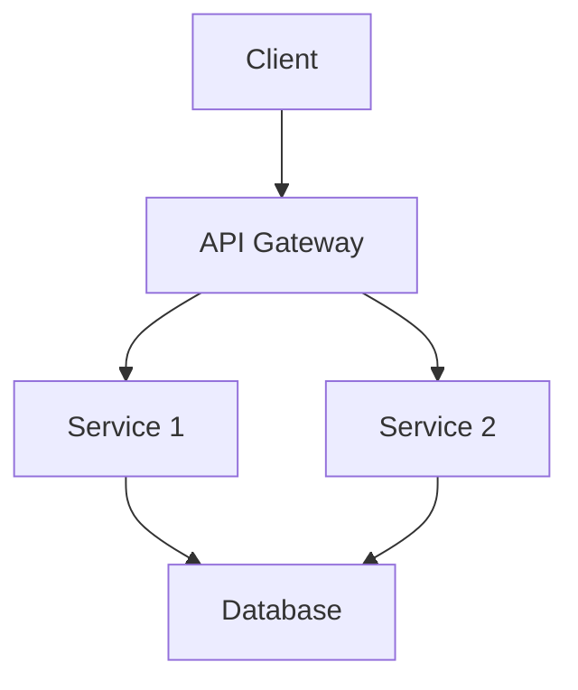
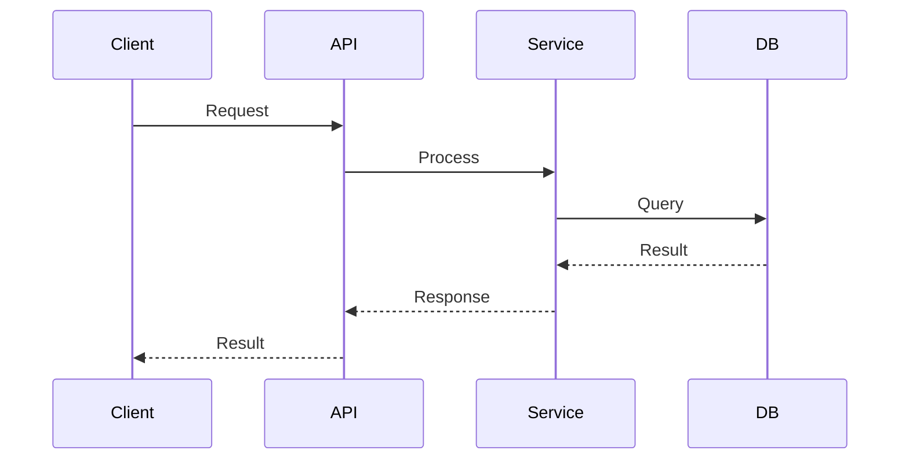
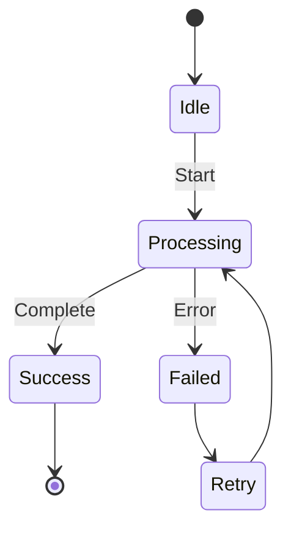

# Architecture Skill

Software architecture patterns, design principles, and documentation practices.

## Core Principles

### Separation of Concerns
- Each module has a single, well-defined responsibility
- Clear boundaries between components
- Minimize coupling between modules

### Modularity
- Components can be understood independently
- Well-defined interfaces
- Easy to replace or upgrade components

### Abstraction Levels
- Appropriate abstraction for the problem domain
- Not over-engineered
- Not under-abstracted

### Dependency Management
- Minimize dependencies
- Depend on abstractions, not concretions
- Use dependency injection where appropriate

## Architecture Documentation

### Mermaid Diagrams
Use Mermaid for architecture diagrams in design documents.

**Component Diagrams:**

**Sequence Diagrams:**

**State Diagrams:**

## Common Patterns

### Layered Architecture
- Presentation layer
- Business logic layer
- Data access layer
- Clear dependencies (top-down)

### Event-Driven Architecture
- Producers and consumers
- Asynchronous communication
- Loose coupling

### Microservices
- Independent deployments
- Service boundaries by domain
- API contracts

### Plugin Architecture
- Core system with extension points
- Plugins provide additional functionality
- Isolation between plugins

## Design Trade-offs

### Performance vs. Maintainability
- Optimize only when necessary
- Profile before optimizing
- Document performance-critical sections

### Flexibility vs. Simplicity
- YAGNI (You Aren't Gonna Need It)
- Don't add features for hypothetical future needs
- Simplest solution that meets requirements

### Abstraction vs. Concreteness
- Abstract when patterns emerge
- Don't abstract prematurely
- Three instances before abstraction

## Integration Points

When designing integration:
- Define clear boundaries
- Document contracts
- Handle failures gracefully
- Version APIs

## Architecture Reviews

When reviewing architecture:
- Does it solve the stated problem?
- Is it the simplest approach?
- Are trade-offs understood?
- Is it consistent with existing patterns?
- Can it evolve as requirements change?

## References

See `references/` directory for detailed architecture patterns and diagram examples.
