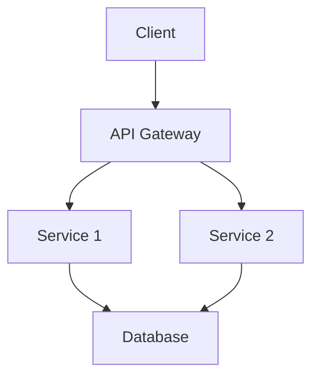
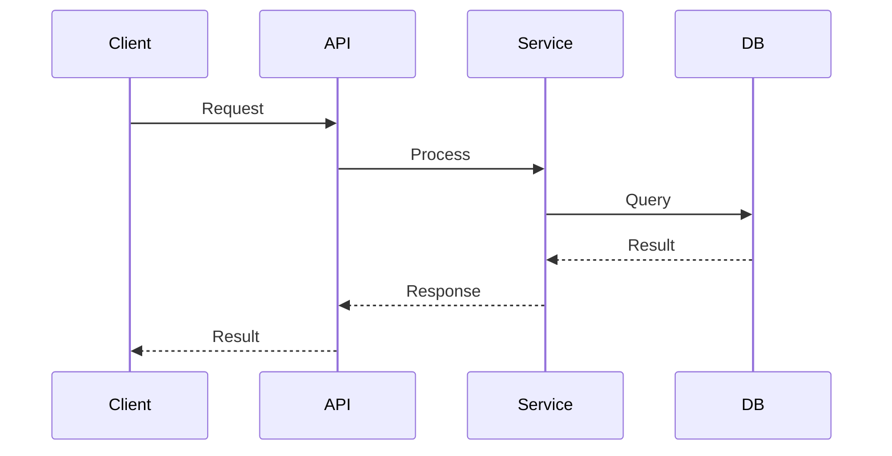
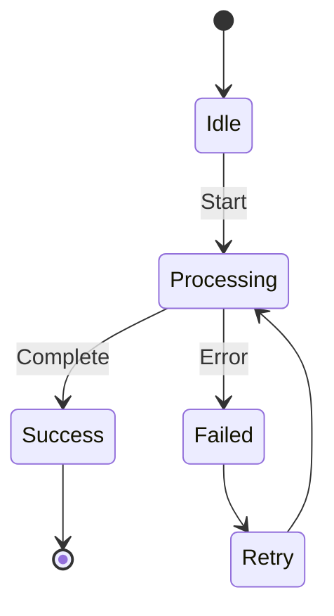
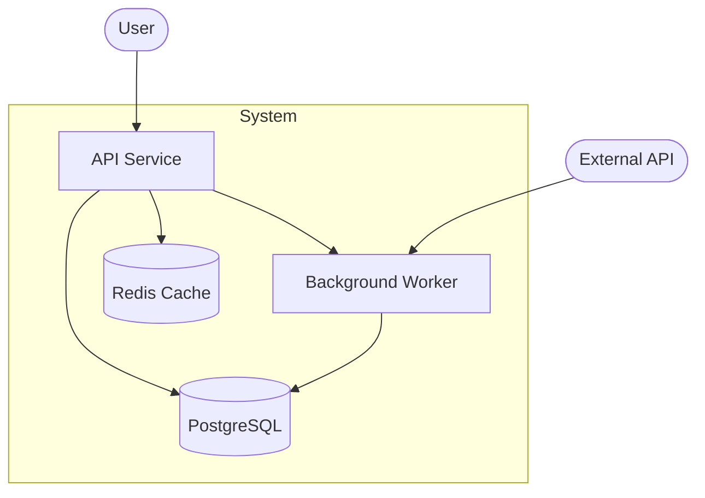

# Architecture Diagram Examples

## Component Diagram

Shows system structure and service relationships.

## Sequence Diagram

Documents interaction flows and timing between components.

## State Diagram

Documents state machines and valid transitions.

## Architecture Diagram (C4-style)

Shows system context with external actors.

## Tips

- Keep diagrams focused — split large systems into multiple views
- Use consistent naming across all diagrams in a document
- Add notes for non-obvious relationships
- Prefer architecture/sequence/state diagrams; fall back to flowcharts when needed
